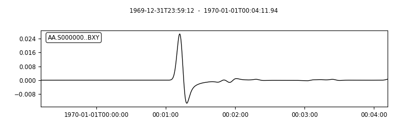
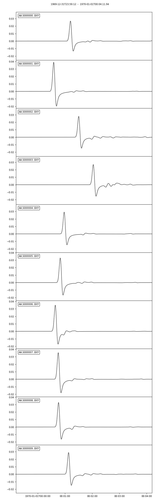

Commmand Line Tool
==================

``SeisFlows`` is primarily interacted with via command line calls and a
parameter file. In this page we explain how to use this command line
tool to create a SeisFlows parameters file, edit and configure it, and
establish a SeisFlows working directory. We also provide explanation for
other command line options which act as helper utilities for improved
package control.

After installing SeisFlows into a Conda environment, the ``seisflows``
command will be available directly from the command line. To access the
help dialogue, you can type ``seisflows`` or ``seisflows -h``

.. code:: ipython3

    ! seisflows

.. parsed-literal::

    usage: seisflows [-h] [-w [WORKDIR]] [-p [PARAMETER_FILE]]
                     {setup,configure,swap,init,submit,resume,restart,clean,par,sempar,check,print,reset,debug,examples}
                     ...
    
    ================================================================================
    
                         SeisFlows: Waveform Inversion Package                      
    
    ================================================================================
    
    optional arguments:
      -h, --help            show this help message and exit
      -w [WORKDIR], --workdir [WORKDIR]
                            The SeisFlows working directory, default: cwd
      -p [PARAMETER_FILE], --parameter_file [PARAMETER_FILE]
                            Parameters file, default: 'parameters.yaml'
    
    command:
      Available SeisFlows arguments and their intended usages
    
        setup               Setup working directory from scratch
        configure           Fill parameter file with defaults
        swap                Swap module parameters in an existing parameter file
        init                Initiate working environment
        submit              Submit initial workflow to system
        resume              Re-submit previous workflow to system
        restart             Remove current environment and submit new workflow
        clean               Remove files relating to an active working environment
        par                 View and edit SeisFlows parameter file
        sempar              View and edit SPECFEM parameter file
        check               Check state of an active environment
        print               Print information related to an active environment
        reset               Reset modules within an active state
        debug               Start interactive debug environment
        examples            Look at and run pre-configured example problems
    
    'seisflows [command] -h' for more detailed descriptions of each command.

Setting up
~~~~~~~~~~

seisflows setup
^^^^^^^^^^^^^^^

The first step of any SeisFlows workflow is to setting up a parameter
file. The ``seisflows setup`` command copies in a template parameter
file.

.. code:: ipython3

    %cd ~/Scratch
    ! rm *
    ! ls

.. parsed-literal::

    /Users/Chow/Scratch

.. code:: ipython3

    ! seisflows setup -h

.. parsed-literal::

    usage: seisflows setup [-h] [-f]
    
    In the specified working directory, copy template parameter file containing
    only module choices, and symlink source code for both the base and super
    repositories for easy edit access. If a parameter file matching the provided
    name exists in the working directory, a prompt will appear asking the user if
    they want to overwrite.
    
    optional arguments:
      -h, --help   show this help message and exit
      -f, --force  automatically overwrites existing parameter file

.. code:: ipython3

    # The '-f' flag (overwrite) will overwrite any existing parameter file
    ! seisflows setup -f

.. parsed-literal::

    creating parameter file: parameters.yaml

Having a look at the template ``parameters.yaml`` file that was just
generated, we can see that it contains some pre-defined default values
for the core SeisFlows modules. Each of these modules defines it’s own
set of unique parameters which make up a workflow.

.. code:: ipython3

    ! ls
    ! wc -l parameters.yaml  # List the number of lines in the file

.. parsed-literal::

    parameters.yaml sflog.txt
          30 parameters.yaml

.. code:: ipython3

    ! cat parameters.yaml

.. parsed-literal::

    # //////////////////////////////////////////////////////////////////////////////
    #
    #                        SeisFlows YAML Parameter File
    #
    # //////////////////////////////////////////////////////////////////////////////
    #
    # Modules correspond to the structure of the source code, and determine
    # SeisFlows' behavior at runtime. Each module requires its own sub-parameters.
    #
    # .. rubric::
    #   - To determine available options for modules listed below, run:
    #       > seisflows print modules
    #   - To auto-fill with docstrings and default values (recommended), run:
    #       > seisflows configure
    #   - To set values as NoneType, use: null
    #   - To set values as infinity, use: inf
    #
    #                                    MODULES
    #                                    ///////
    # workflow (str):    The types and order of functions for running SeisFlows
    # system (str):      Computer architecture of the system being used
    # solver (str):      External numerical solver to use for waveform simulations
    # preprocess (str):  Preprocessing schema for waveform data
    # optimize (str):    Optimization algorithm for the inverse problem
    # ==============================================================================
    workflow: forward
    system: workstation
    solver: specfem2d
    preprocess: default
    optimize: gradient

seisflows configure
^^^^^^^^^^^^^^^^^^^

We can now run the ``seisflows configure`` command which will build out
our parameter file based on the module choices provided in the parameter
file.

.. code:: ipython3

    ! seisflows configure -h

.. parsed-literal::

    usage: seisflows configure [-h] [-a]
    
    SeisFlows parameter files will vary depending on chosen modules and their
    respective required parameters. This function will dynamically traverse the
    source code and generate a template parameter file based on module choices.
    The resulting file incldues docstrings and type hints for each parameter.
    Optional parameters will be set with default values and required parameters
    and paths will be marked appropriately. Required parameters must be set before
    a workflow can be submitted.
    
    optional arguments:
      -h, --help            show this help message and exit
      -a, --absolute_paths  Set default paths relative to cwd

.. code:: ipython3

    ! seisflows configure

.. code:: ipython3

    ! head -200 parameters.yaml | tail -n 82  # have a look at the middle of the file
    ! echo
    ! wc -l parameters.yaml

.. parsed-literal::

    #    :param smooth_v: Gaussian half-width for vertical smoothing in units
    #        of meters.
    #    :type components: str
    #    :param components: components to consider and tag data with. Should be
    #        string of letters such as 'RTZ'
    #    :type solver_io: str
    #    :param solver_io: format of model/kernel/gradient files expected by the
    #        numerical solver. Available: ['fortran_binary': default .bin files].
    #        TODO: ['adios': ADIOS formatted files]
    #    :type source_prefix: str
    #    :param source_prefix: prefix of source/event/earthquake files. If None,
    #        will attempt to guess based on the specific solver chosen.
    #    :type mpiexec: str
    #    :param mpiexec: MPI executable used to run parallel processes. Should also
    #        be defined for the system module
    #
    #        
    #    Solver SPECFEM2D
    #    ----------------
    #    SPECFEM2D-specific alterations to the base SPECFEM module
    #
    #    Parameters
    #    ----------
    #    :type source_prefix: str
    #    :param source_prefix: Prefix of source files in path SPECFEM_DATA. Defaults
    #        to 'SOURCE'
    #    :type multiples: bool
    #    :param multiples: set an absorbing top-boundary condition
    #
    #        
    # =============================================================================
    data_format: ascii
    materials: acoustic
    density: False
    attenuation: False
    smooth_h: 0.0
    smooth_v: 0.0
    components: ZNE
    source_prefix: SOURCE
    multiples: False
    # =============================================================================
    #
    #    Default Preprocess
    #    ------------------
    #    Data processing for seismic traces, with options for data misfit,
    #    filtering, normalization and muting.
    #
    #    Parameters
    #    ----------
    #    :type data_format: str
    #    :param data_format: data format for reading traces into memory. For
    #        available see: seisflows.plugins.preprocess.readers
    #    :type misfit: str
    #    :param misfit: misfit function for waveform comparisons. For available
    #        see seisflows.plugins.preprocess.misfit
    #    :type backproject: str
    #    :param backproject: backprojection function for migration, or the
    #        objective function in FWI. For available see
    #        seisflows.plugins.preprocess.adjoint
    #    :type normalize: str
    #    :param normalize: Data normalization parameters used to normalize the
    #        amplitudes of waveforms. Choose from two sets:
    #        ENORML1: normalize per event by L1 of traces; OR
    #        ENORML2: normalize per event by L2 of traces;
    #        &
    #        TNORML1: normalize per trace by L1 of itself; OR
    #        TNORML2: normalize per trace by L2 of itself
    #    :type filter: str
    #    :param filter: Data filtering type, available options are:
    #        BANDPASS (req. MIN/MAX PERIOD/FREQ);
    #        LOWPASS (req. MAX_FREQ or MIN_PERIOD);
    #        HIGHPASS (req. MIN_FREQ or MAX_PERIOD)
    #    :type min_period: float
    #    :param min_period: Minimum filter period applied to time series.
    #        See also MIN_FREQ, MAX_FREQ, if User defines FREQ parameters, they
    #        will overwrite PERIOD parameters.
    #    :type max_period: float
    #    :param max_period: Maximum filter period applied to time series. See
    #        also MIN_FREQ, MAX_FREQ, if User defines FREQ parameters, they will
    #        overwrite PERIOD parameters.
    #    :type min_freq: float
    #    :param min_freq: Maximum filter frequency applied to time series,
    
         337 parameters.yaml

We can see that our parameter file is over 300 lines, a bit too
cumbersome to print on the page. The length of the file mostly arises
from the header, as each parameter gets it’s own entry with the
parameter’s type, docstring, and any available options. Each set of
parameters are separated by their relevant module, and their respective
docstrings should help users understand how and when they are used in a
SeisFlows workflow.

   **NOTE**: Many parameters have sensible default values chosen, but it
   is up to the user to decide which parameters are relevant to them,
   and how they would like them set. Internal check functions throughout
   the package will raise AssertionErrors for incorrectly or improperly
   set parameters.

Editing the parameter file
~~~~~~~~~~~~~~~~~~~~~~~~~~

seisflows par
^^^^^^^^^^^^^

You can always open your favorite text editor to make changes to the
parameter file, however the ``seisflows par`` command makes things
easier by allowing you to view and edit values from the command line.
This makes it convenient to change parameters quickly and allows you to
script your parameter file setup for improved reproducibility.

.. code:: ipython3

    ! seisflows par -h

.. parsed-literal::

    usage: seisflows par [-h] [-p] [parameter] [value]
    
    Directly edit values in the parameter file by providing the parameter and
    corresponding value. If no value is provided, will simply print out the
    current value of the given parameter. Works also with path names.
    
    positional arguments:
      parameter         Parameter to edit or view, (case independent).
      value             Optional value to set parameter to. If not given, will
                        print out current parameter. If given, will replace
                        current parameter with new value. Set as 'null' for
                        NoneType and set '' for empty string
    
    optional arguments:
      -h, --help        show this help message and exit
      -p, --skip_print  Skip the print statement which is typically sent to stdout
                        after changing parameters.

The call structure of the ``par`` command is provided in the help
message:

   seisflows par [parameter] [value (optional)]

We can view parameters by providing a single ‘parameter’ argument to the
``par`` command

.. code:: ipython3

    ! seisflows par ntask  # ntask is the number of tasks/events to be run during a workflow

.. parsed-literal::

    ntask: 1

We can change a given parameter from it’s original value by providing a
second ‘value’ argument

.. code:: ipython3

    ! seisflows par ntask 3

.. parsed-literal::

    ntask: 1 -> 3

seisflows sempar
^^^^^^^^^^^^^^^^

The ``seisflows sempar`` command behaves the same as the ``par``
command, except is used to edit a SPECFEM2D/3D/3D_GLOBE Par_file. It has
the same call structure as ``par``.

seisflows check
^^^^^^^^^^^^^^^

Each module contains it’s own internal set of parameter checks which
make sure that reasonable parameter values and types have been chosen.
This is especially important when submitting large jobs on clusters as
the ``check`` function will allow the User to catch errors without
having to wait on queue times or waste computational resources.

.. code:: ipython3

    ! seisflows check

.. parsed-literal::

    
    ================================================================================
                                    PARAMETER ERRROR                                
                                    ////////////////                                
    `path_specfem_bin` must exist and must point to directory containing SPECFEM
    executables
    ================================================================================

Here we can see that a given path has not been set correctly in the
parameter file.

seisflows swap
^^^^^^^^^^^^^^

The ``seisflows swap`` command allows you to swap out a set of module
parameters without affecting other parts of the parameter file. Some
cases for when this might be useful include switching from a
‘workstation’ system to a ‘cluster’ system, or swapping solvers from
‘specfem2d’ to ‘specfem3d’.

.. code:: ipython3

    ! seisflows swap -h

.. parsed-literal::

    usage: seisflows swap [-h] [module] [classname]
    
    During workflow development, it may be necessary to swap between different
    sub-modules (e.g., system.workstation -> system.cluster). However this would
    typically involving re-generating and re-filling a parameter file. The 'swap'
    function makes it easier to swap parameters between modules.
    
    positional arguments:
      module      Module name to swap
      classname   Classname to swap to
    
    optional arguments:
      -h, --help  show this help message and exit

Running workflows
~~~~~~~~~~~~~~~~~

seisflows submit
^^^^^^^^^^^^^^^^

To run SeisFlows, we use the ``submit`` call. This will submit the
``workflow`` to the ``system`` and continue until a User-defined stop
criteria is met.

Under the hood, the ``submit`` function will differ depending on the
chosen ``system``. For Users running on laptops and workstations,
``submit`` will simply launch a Python process and step through the
tasks in the ``workflow`` task list. On clusters, ``submit`` will launch
a master job on a compute node, which will itself step through tasks in
the task list, ensuring that no processing is run on login nodes.

.. code:: ipython3

    ! seisflows submit -h

.. parsed-literal::

    usage: seisflows submit [-h] [-s STOP_AFTER]
    
    The main SeisFlows execution command. Submit a SeisFlows workflow to the
    chosen system, equal to executing seisflows.workflow.main(). This function
    will create and fill the working directory with required paths, perform path
    and parameter error checking, and establish the active working environment
    before executing the workflow.
    
    optional arguments:
      -h, --help            show this help message and exit
      -s STOP_AFTER, --stop_after STOP_AFTER
                            Optional override of the 'STOP_AFTER' parameter

seisflows clean
^^^^^^^^^^^^^^^

The ``clean`` function is used to clear an existing working directory.
It deletes all SeisFlows created files and directories using paths in
the parameter file, but does not delete the parameter file itself. Use
the ``-f/--force`` flag to skip over the ‘are you sure?’ check
statement.

.. code:: ipython3

    ! seisflows clean -h 

.. parsed-literal::

    usage: seisflows clean [-h] [-f]
    
    Delete all SeisFlows related files in the working directory, except for the
    parameter file.
    
    optional arguments:
      -h, --help   show this help message and exit
      -f, --force  Skip the warning check that precedes the clean function

seisflows restart
^^^^^^^^^^^^^^^^^

The ``restart`` function is a convenience function which wraps ``clean``
and ``submit``. It is used to restart workflows using the same parameter
file. It also takes the ``-f/--force`` flag that the clean function
defines.

.. code:: ipython3

    ! seisflows restart -h

.. parsed-literal::

    usage: seisflows restart [-h] [-f]
    
    Akin to running seisflows clean; seisflows submit. Restarts the workflow by
    removing the current state and submitting a fresh workflow.
    
    optional arguments:
      -h, --help   show this help message and exit
      -f, --force  Skip the clean warning check statement

Plotting
~~~~~~~~

.. code:: ipython3

    from IPython.display import Image  # Required for showing inline figures in notebook/docs

seisflows plot2d
^^^^^^^^^^^^^^^^

``plot2d`` allows you to quickly plot SPECFEM2D models, kernels and
gradients which have been exported to disk during a SeisFlows workflow.
From a SeisFlows working directory the format for running ``plot2d`` is
provided in the help message.

.. code:: ipython3

    # a directory where we have run an example problem
    %cd ~/sfexamples/example_2
    ! ls

.. parsed-literal::

    /home/bchow/Work/work/seisflows_example/example_2
    logs	parameters.yaml  sflog.txt    specfem2d
    output	scratch		 sfstate.txt  specfem2d_workdir

.. code:: ipython3

    ! seisflows plot2d -h

.. parsed-literal::

    usage: seisflows plot2d [-h] [-c [CMAP]] [-s [SAVEFIG]] [name] [parameter]
    
    Plots model/kernels/gradient files located in the output/
            directory. ONLY available for SPECFEM2D models.
    
    positional arguments:
      name                  Name of directory in the output/ directory
      parameter             Name of parameter to plot from `name`. E.g., 'vs',
                            'vp' etc.
    
    optional arguments:
      -h, --help            show this help message and exit
      -c [CMAP], --cmap [CMAP]
                            colormap to be passed to PyPlot
      -s [SAVEFIG], --savefig [SAVEFIG]
                            optional name and path to save figure

Running ``plot2d`` without any arguments will print out a list of
available directories you can plot

.. code:: ipython3

    ! seisflows plot2d 

.. parsed-literal::

                                         PLOT2D                                     
                                         //////                                     
    Available models/gradients/kernels
    
    GRADIENT_01
    GRADIENT_02
    MODEL_01
    MODEL_02
    MODEL_INIT
    MODEL_TRUE

Users will also have to choose which parameter they would like to plot,
which is defined by the available parameters in the underlying model.
Incorrect choices will throw an AssertionError which will tell you what
parameters are available to plot.

.. code:: ipython3

    ! seisflows plot2d GRADIENT_01

.. parsed-literal::

    Traceback (most recent call last):
      File "/home/bchow/miniconda3/envs/docs/bin/seisflows", line 33, in <module>
        sys.exit(load_entry_point('seisflows', 'console_scripts', 'seisflows')())
      File "/home/bchow/REPOSITORIES/seisflows/seisflows/seisflows.py", line 1383, in main
        sf()
      File "/home/bchow/REPOSITORIES/seisflows/seisflows/seisflows.py", line 438, in __call__
        getattr(self, self._args.command)(**vars(self._args))
      File "/home/bchow/REPOSITORIES/seisflows/seisflows/seisflows.py", line 1106, in plot2d
        save=savefig)
      File "/home/bchow/REPOSITORIES/seisflows/seisflows/tools/specfem.py", line 428, in plot2d
        f"chosen `parameter` must be in {self._parameters}"
    AssertionError: chosen `parameter` must be in ['vp_kernel', 'vs_kernel']

.. code:: ipython3

    ! seisflows plot2d GRADIENT_01 vs_kernel --savefig gradient_01_vs_kernel.png
    Image(filename='gradient_01_vs_kernel.png') 

.. parsed-literal::

    Figure(707.107x707.107)

.. image:: images/command_line_tool_files/command_line_tool_40_1.png

seisflows plotst
^^^^^^^^^^^^^^^^

``plotst`` (i.e., *plot st*\ ream) is a wrapper for ObsPy’s
Stream.plot() which plots waveforms generated by the external numerical
solver. In this case we have generated waveforms in the ASCII format
during one of our example problems. Using the ``export_traces``
parameter, our workflow has saved these waveforms to the ``output/``
directory of our SeisFlows working directory.

.. code:: ipython3

    %cd ~/sfexamples/example_3/output/solver/001/syn
    ! ls

.. parsed-literal::

    /home/bchow/Work/work/seisflows_example/example_3/output/solver/001/syn
    AA.S000000.BXY.semd  AA.S000009.BXY.semd  AA.S000018.BXY.semd
    AA.S000001.BXY.semd  AA.S000010.BXY.semd  AA.S000019.BXY.semd
    AA.S000002.BXY.semd  AA.S000011.BXY.semd  AA.S000020.BXY.semd
    AA.S000003.BXY.semd  AA.S000012.BXY.semd  AA.S000021.BXY.semd
    AA.S000004.BXY.semd  AA.S000013.BXY.semd  AA.S000022.BXY.semd
    AA.S000005.BXY.semd  AA.S000014.BXY.semd  AA.S000023.BXY.semd
    AA.S000006.BXY.semd  AA.S000015.BXY.semd  AA.S000024.BXY.semd
    AA.S000007.BXY.semd  AA.S000016.BXY.semd
    AA.S000008.BXY.semd  AA.S000017.BXY.semd

.. code:: ipython3

    # Run the help message
    ! seisflows plotst -h

.. parsed-literal::

    usage: seisflows plotst [-h] [--data_format [DATA_FORMAT]] [-s [SAVEFIG]]
                            [fids [fids ...]]
    
    Plots waveforms output by the solver. Uses ObsPy's 
    Stream.plot() function under the hood. Example call would be 
    `seisflows plotst scratch/solver/mainsolver/traces/syn/*`
            
    
    positional arguments:
      fids                  File IDs to be passed to plotting. Wildcards
                            acceptable
    
    optional arguments:
      -h, --help            show this help message and exit
      --data_format [DATA_FORMAT]
                            Data format of the files. Must match file type that
                            SeisFlows can read. These include:['SU', 'ASCII'].
                            Defaults to 'ASCII'. See
                            SeisFlows.preprocess.default.read() for all options.
      -s [SAVEFIG], --savefig [SAVEFIG]
                            optional name and path to save figure

.. code:: ipython3

    # Plot a single synthetic seismogram
    ! seisflows plotst AA.S000000.BXY.semd --savefig AA.S000000.BXY.semd.png
    Image("AA.S000000.BXY.semd.png")

.. code:: ipython3

    # Use wild cards to plot multiple stations at once
    ! seisflows plotst AA.S00000?.BXY.semd --savefig AA.S00000X.BXY.semd.png
    Image("AA.S00000X.BXY.semd.png")

