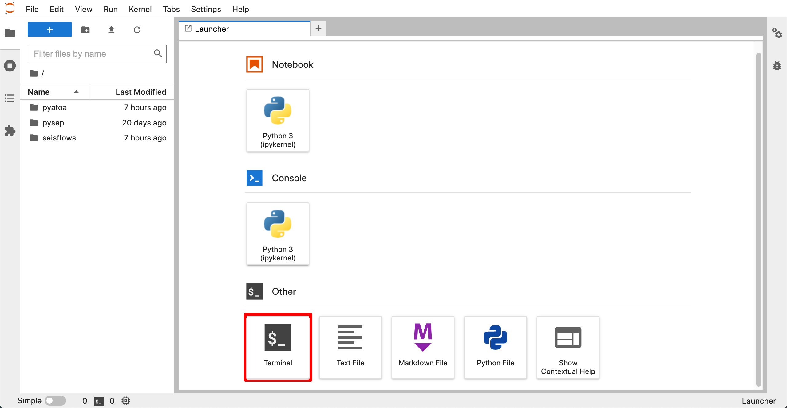
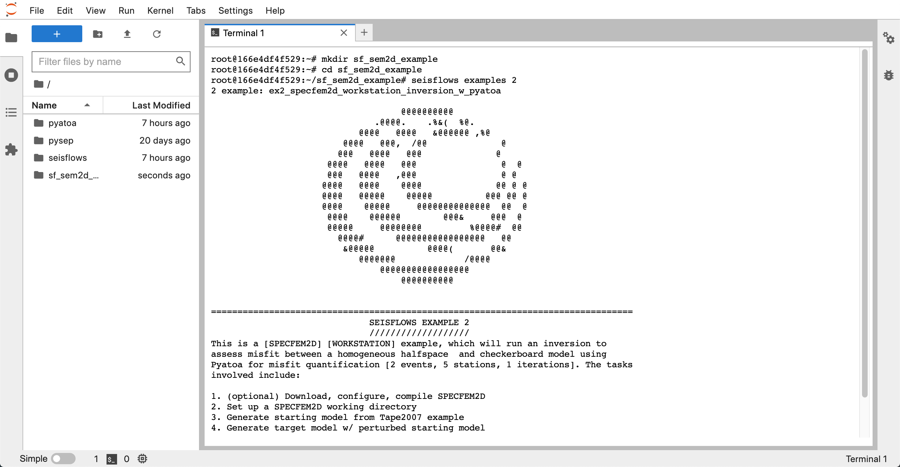

SeisFlows in Containers
=======================

As part of the `NSF-funded SCOPED project
<https://www.nsf.gov/awardsearch/showAward?AWD_ID=2104052>`__ SeisFlows has
been containerized using `Docker <https://www.docker.com/>`__, which removes the
oftentimes troubling task of installing and configuring software. These
containers can be used to run SeisFlows on workstations (using Docker) or
on high performance computers using
`Singularity/Apptainer <https://apptainer.org/>`__.

.. note::
    The SeisFlows Docker image can be found here:
    https://github.com/SeisSCOPED/adjtomo

.. note::
    The `adjTomo` container is shipped with the latest versions of
    `SeisFlows <https://github.com/adjtomo/seisflows>`__,
    `Pyatoa <https://github.com/adjtomo/pyatoa>`__, and
    `PySEP <https://github.com/uafgeotools/pysep>`__.

The remainder of this documentation page assumes you are familiar with Docker
and containers.

To learn more about Docker and containers, see:
https://www.docker.com/resources/what-container/

For instructions to install Docker on your workstation, visit:
https://docs.docker.com/get-docker/

Workstation example with Docker
-------------------------------

Here we will step through how to run the
`SeisFlows-SPECFEM2D <specfem2d_example.html>`__ example using Docker.
First we need to get the latest version of the `Pyatoa` Docker image:

.. code-block:: bash

    docker pull ghcr.io/seisscoped/adjtomo:latest

.. note::
    These docs were run using Docker image ID ``c57883926aae`` (last accessed
    Aug. 24, 2022). If you notice that the docs page is out of date with respect
    to the latest Docker image, please raise a
    `SeisFlows GitHub issue <https://github.com/adjtomo/seisflows/issues>`__.

Their are two methods for running the SeisFlows example using this Docker image,
either 1) through a `JupyterHub interface <https://jupyter.org/hub>`__, or
2) via the command line. The former provides a graphical user interface that
mimics a virtual desktop for easier navigation, while the latter provides a
push-button approach.

From JupyterHub
^^^^^^^^^^^^^^^

We can run SeisFlows through JupyterHub by opening the container through a port:

.. code-block:: bash

    docker run -p 8888:8888 \
        --mount type=bind,source=$(pwd),target=/home/scoped/work
        ghcr.io/seisscoped/pyatoa:latest

.. warning::
    If you do **not** use the ``--mount`` command, all progres will be lost
    once you close the container. See the
    `Docker bind mounts <https://docs.docker.com/storage/bind-mounts/>`__
    documentation for more information.

To access the JupyterHub instance, open the URL that was output to the display
in your favorite web browser. The URL will likely look something like
http://127.0.0.1:8888/lab?token=??? where '???' is a unique token

Within the JupyterHub instance, you will be greeted with a graphical
user interface (see below). The Pyatoa, PySEP and SeisFlows repositories are
navigable in the file system on the left-hand side of the window.

|
From inside the JupyterHub instance, click the `Terminal` icon (highlighted red
above) to open up a terminal window. Using the terminal we will run our example
in an empty directory to avoid muddling up the home directory.

.. code-block:: bash

    # From inside the JupyterHub terminal
    mkdir sf_sem2d_example
    cd sf_sem2d_example
    seisflows examples run 2

|
This example will download, configure and compile SPECFEM2D, and then run a
SeisFlows-Pyatoa-SPECFEM2D inversion problem. See `the SPECFEM2D example docs
page <specfem2d_example.html>`__ for a more thorough explanation of what's
going on under the hood.

A successful inversion

From the command line
^^^^^^^^^^^^^^^^^^^^^

Running the container from the command line is much simpler. To print the
SeisFlows help message, we simply have to run the following:

.. code-block:: bash

    docker run ghcr.io/seisscoped/adjtomo:latest seisflows -h

The following code snippet will run a SeisFlows-Pyatoa-Specfem2D example.
The extra fluff in the command allows the container to save files to your
computer while it runs the example.

.. code-block:: bash

    WORKDIR=/Users/Chow/Work/scratch  # choose your own directory here
    cd ${WORKDIR}
    docker run \
        --workdir $(pwd) \
        --mount type=bind,source=$(pwd),target=$(pwd),
        ghcr.io/seisscoped/adjtomo:nightly \
        seisflows examples run 2

In the above example, we set the working directory (-w/--workdir) to the
current working directory (on the local filesystem). We also mount the current
working directory inside the container (--mount), meaning the container has
access to our local filesystem for reading/writing. We then use the Docker
image to run a SeisFlows-Pyatoa-Specfem2D example. Outputs of the example will
be written into the working directory (WORKDIR).

See `the SPECFEM2D example docs page <specfem2d_example.html>`__
for a more thorough explanation of what's going on under the hood.

HPC example with Apptainer/Singularity
--------------------------------------

.. note::
    Section Under Construction

Apptainer/Singularity is a container system for high performance computers (HPC)
that allows Users to run container images on HPCs. You might want to use
Apptainer if you cannot download software using Conda on your HPC, or you simply
do not want to go through the trouble of downloading software on your system.

Relevant Links:

* Singularity on Chinook: 
  https://uaf-rcs.gitbook.io/uaf-rcs-hpc-docs/third-party-software/singularity
* Singularity at TACC:
  https://containers-at-tacc.readthedocs.io/en/latest/singularity/01.singularity_basics.html
* Singularity on Maui:
  https://support.nesi.org.nz/hc/en-gb/articles/360001107916-Singularity

.. note::
    This section was written while working on TACC's Frontera, a SLURM system.
    Instructions may differ depending on your Systems setup and workload
    manager. Because Singularity cannot be run on the login nodes at TACC, the
    following code blocks are run in the `idev <https://frontera-portal.tacc.
    utexas.edu/user-guide/running/#interactive-sessions-with-idev-and-srun>`__
    interactive environment.

To download the required image on your system, we first need to load the
singularity module, and then use a familiar ``pull`` command.

.. code-block:: bash

    module load tacc-singularity  # on TACC Frontera
    # module load singularity  # on UAF Chinook
    singularity pull seisflows.sif docker://ghcr.io/seisscoped/adjtomo:nightly

We have now downloaded our image as a `.sif` file. To use the image to run the
SeisFlows help message:

.. code-block:: bash

    singularity run seisflows.sif seisflows -h

To get SeisFlows to use your system's Singularity (if supported), you just need
to append '-singularity' to an existing system subclass in the SeisFlows
parameter file. For example, since we are running on Frontera, we set our
system to 'frontera-singularity'.

.. code-block:: bash

    seisflows setup  # create the 'parameters.yaml' file
    seisflows par system frontera-singularity  # set the system
    # ... set any other main modules here
    seisflows configure  # fill out the parameter file
    # ... edit your parameters here and then run SeisFlows
    singularity run ghcr.io/seisscoped/adjtomo:nightly seisflows submit

