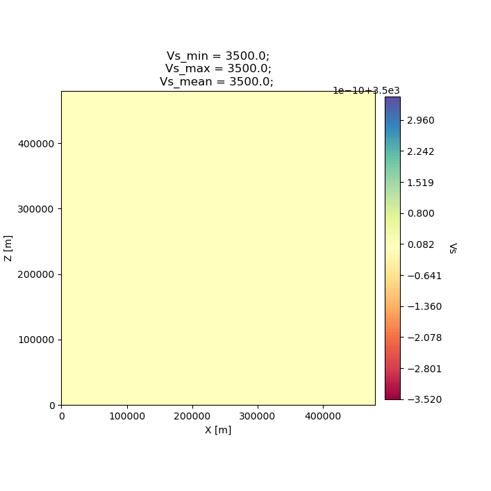
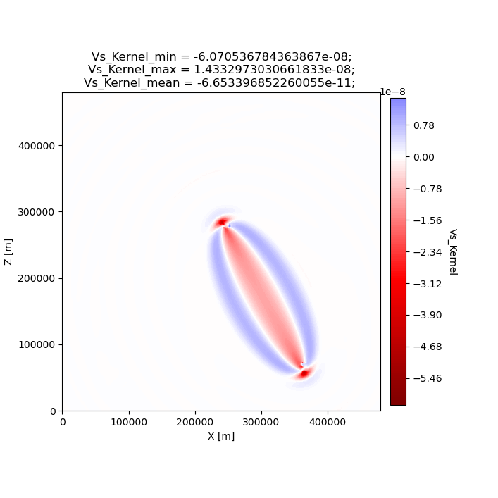
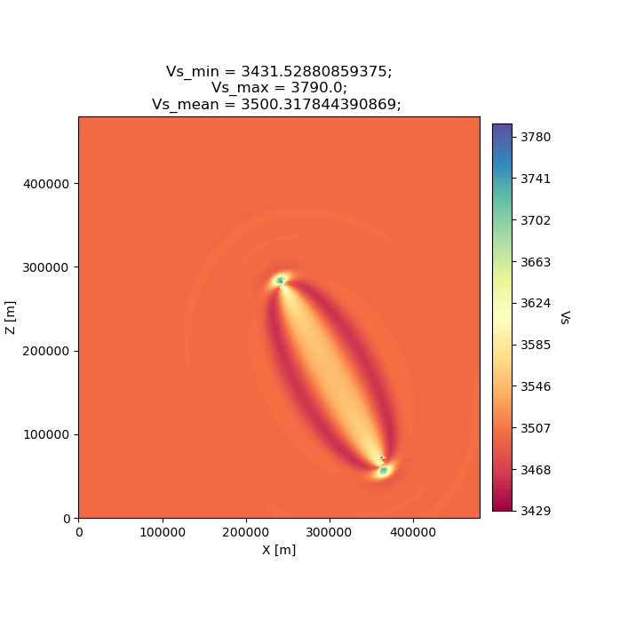
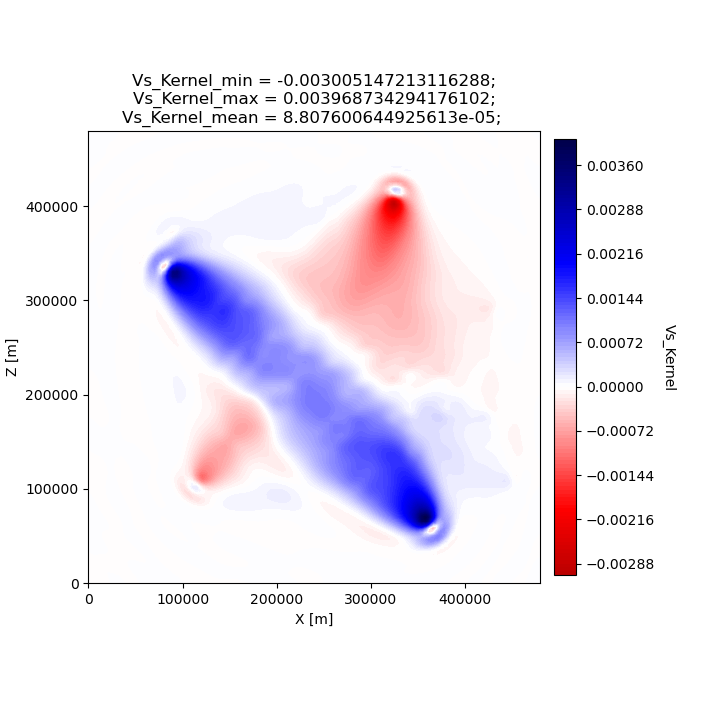
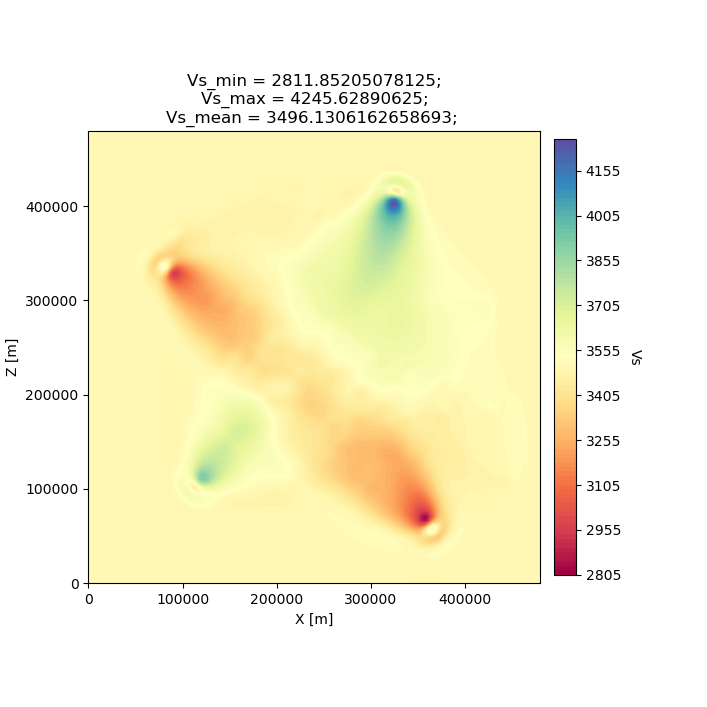
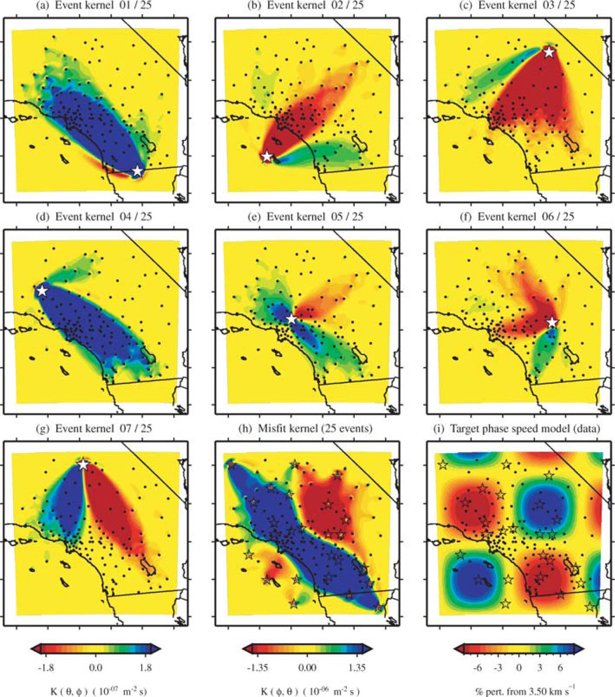
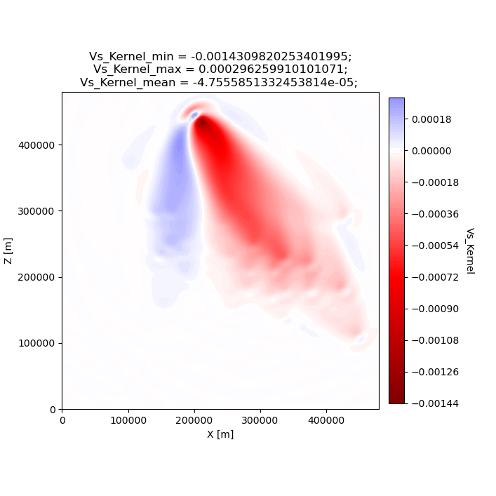
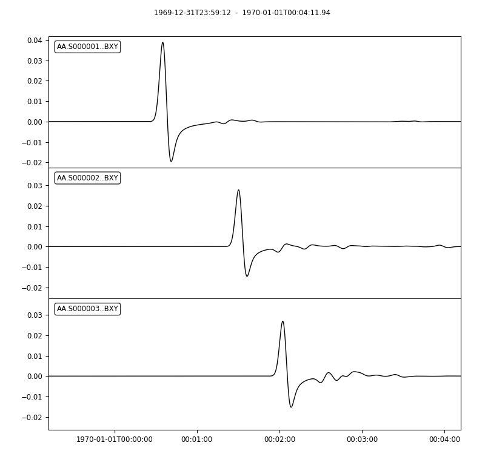

Specfem2D Workstation Examples
==============================

SeisFlows comes with some **Specfem2D synthetic examples** to showcase
the software in action. These examples are meant to be run on a **local
machine** (tested on a Linux workstation running CentOS 7, and an Apple
Laptop running macOS 10.14.6).

The numerical solver we will use is:
`SPECFEM2D <https://geodynamics.org/cig/software/specfem2d/>`__. We’ll
also be working in our ``seisflows``
`Conda <https://docs.conda.io/en/latest/>`__ environment, see the
installation section on the home page for instructions on how to install
and activate the required Conda environment.

--------------

.. warning:: 
    If you do not have a compiled version of SPECFEM2D, then each example will attempt to automatically download and compile SPECFEM2D. This step may fail if you do not have software required by SPECFEM2D, if there are issues with the SPECFEM2D repository itself, or if the configuration and compiling steps fail. If you run any issues, it is recommended that you manually install and compile SPECFEM2D, and directly provide its path to this example problem using the -r or --specfem2d_repo flags (shown below).

.. code:: ipython3

    from IPython.display import Image  # Used to display .png files in the notebook/docs

Example #1: Homogenous Halfspace Inversion
------------------------------------------

Example #1 runs a 1-iteration synthetic inversion with 1 event and 1
station, used to illustrate misfit kernels and updated models in adjoint
tomography.

The starting/initial model (*MODEL_INIT*) and target/true model
(*MODEL_TRUE*) are used to generate synthetics and (synthetic) data,
respectively. Both models are homogeneous halfspace models defined by
velocity (Vp, Vs) and density (:math:`\rho`) with slightly varying P-
and S-wave velocity values (**INIT**: :math:`V_p`\ =5.8km/s,
:math:`V_s`\ =3.5km/s; **TRUE**: :math:`V_p`\ =5.9km/s,
:math:`V_s`\ =3.55km/s). Only Vp and Vs are updated during the example.

Misfit during Example #1 is defined by a ‘traveltime’ misfit using the
``Default`` preprocessing module. It also uses a ``gradient-descent``
optimization algorithm paired with a bracketing line search. No
smoothing/regularization is applied to the gradient.

.. code:: ipython3

    ! seisflows examples 1  # print example help dialogue

.. parsed-literal::

    No existing SPECFEM2D repo given, default to: /home/bchow/REPOSITORIES/seisflows/docs/notebooks/specfem2d
    
                                        @@@@@@@@@@                        
                                   .@@@@.    .%&(  %@.          
                                @@@@   @@@@   &@@@@@@ ,%@       
                             @@@@   @@@,  /@@              @    
                            @@@   @@@@   @@@              @     
                          @@@@   @@@@   @@@                @  @ 
                          @@@   @@@@   ,@@@                @ @  
                         @@@@   @@@@    @@@@              @@ @ @
                         @@@@   @@@@@    @@@@@          @@@ @@ @
                         @@@@    @@@@@     @@@@@@@@@@@@@@  @@  @
                          @@@@    @@@@@@        @@@&     @@@  @ 
                          @@@@@     @@@@@@@@         %@@@@#  @@ 
                            @@@@#      @@@@@@@@@@@@@@@@@   @@   
                             &@@@@@          @@@@(       @@&    
                                @@@@@@@             /@@@@       
                                    @@@@@@@@@@@@@@@@@
                                        @@@@@@@@@@          
    
    
    ================================================================================
                                  SEISFLOWS EXAMPLE 1                               
                                  ///////////////////                               
    This is a [SPECFEM2D] [WORKSTATION] example, which will run an inversion to
    assess misfit between two homogeneous halfspace models with slightly different
    velocities. [1 events, 1 station, 1 iterations]. The tasks involved include:
    
    1. (optional) Download, configure, compile SPECFEM2D
    2. [Setup] a SPECFEM2D working directory
    3. [Setup] starting model from 'Tape2007' example
    4. [Setup] target model w/ perturbed starting model
    5. [Setup] a SeisFlows working directory
    6. [Run] the inversion workflow
    ================================================================================

Running the example
~~~~~~~~~~~~~~~~~~~

You can either setup and run the example in separate tasks using the
``seisflows examples setup`` and ``seisflows submit`` commands, or by
directly running the example after setup using the ``examples run``
command (illustrated below).

Use the ``-r`` or ``--specfem2d_repo`` flag to point SeisFlows at an
existing SPECFEM2D/ repository (with compiled binaries) if available. If
not given, SeisFlows will automatically download, configure and compile
SPECFEM2D in your current working directory.

.. code:: ipython3

    # Run command with open variable to set SPECFEM2D path
    ! seisflows examples setup 1 -r ${PATH_TO_SPECFEM2D}
    ! seisflows submit
    
    # The following command is the same as above
    ! seisflows examples run 1 --specfem2d_repo ${PATH_TO_SPECFEM2D}

Running with MPI
^^^^^^^^^^^^^^^^

If you have compiled SPECFEM2D with MPI, and have MPI installed and
loaded on your system, you can run this example with MPI. To do so, you
only need use the ``--with_mpi`` flag. By default SeisFlows will use
only 1 core, but you can choose the number of processors/tasks with the
``--nproc ${NPROC}`` flag. The example call runs example 1 with 4 cores.

.. code:: ipython3

    # Run Solver tasks with MPI on 4 cores
    ! seisflows examples run 1 -r ${PATH_TO_SPECFEM2D} --with_mpi --nproc 4

By default the example problems assume that your MPI executable is
``mpirun``. If for any reason ``mpirun`` is not what your system uses to
call MPI, you can use the ``--mpiexec ${MPIEXEC}`` flag to change that.

.. code:: ipython3

    ! seisflows examples run 1 -r ${PATH_TO_SPECFEM2D} --with_mpi --nproc 4 --mpiexec srun

We will not run the example in this notebook, however at this stage the
User should run one of the following commands above to execute the
example problem. A successfully completed example problem will end with
the following log messages:

.. code:: bash

    CLEANING WORKDIR FOR NEXT ITERATION
    --------------------------------------------------------------------------------
    2022-08-29 15:51:05 (I) | thrifty inversion encountering first iteration, defaulting to standard inversion workflow
    2022-08-29 15:51:06 (I) | 
    ////////////////////////////////////////////////////////////////////////////////
                                 COMPLETE ITERATION 01                              
    ////////////////////////////////////////////////////////////////////////////////
    2022-08-29 15:51:06 (I) | setting current iteration to: 2
    
    ================================================================================
    EXAMPLE COMPLETED SUCCESFULLY
    ================================================================================

    
Using the `working directory documentation page <working_directory.html>`__ you can figure out how to navigate around and look at the results of this small inversion problem. 

We will have a look at a few of the files and directories here. I've run the example problem in a scratch directory but your output directory should look the same.

.. code:: ipython3

    %cd ~/sfexamples/example_1
    ! ls

.. parsed-literal::

    /home/bchow/Work/work/seisflows_example/example_1
    logs	parameters.yaml  sflog.txt    specfem2d
    output	scratch		 sfstate.txt  specfem2d_workdir

Understanding example outputs
~~~~~~~~~~~~~~~~~~~~~~~~~~~~~

In the ``output/`` directory, we can see our starting/initial model
(*MODEL_INIT*), our true/target model (*MODEL_TRUE*) and the updated
model from the first iteration (*MODEL_01*). In addition, we have saved
the gradient generated during the first iteration (*GRADIENT_01*)
because we set the parameter ``export_gradient`` to True.

.. code:: ipython3

    # The output directory contains important files exported during a workflow
    ! ls output

.. parsed-literal::

    GRADIENT_01  MODEL_01  MODEL_INIT  MODEL_TRUE

.. code:: ipython3

    # A MODEL output directory contains model files in the chosen solver format. 
    # In this case, Fortran Binary from SPECFEM2D
    ! ls output/MODEL_01

.. parsed-literal::

    proc000000_vp.bin  proc000000_vs.bin

Plotting results
~~~~~~~~~~~~~~~~

We can plot the model and gradient files created during our workflow
using the ``seisflows plot2d`` command. The ``--savefig`` flag allows us
to save output .png files to disk. The following figure shows the
starting/initial homogeneous halfspace model in Vs.

.. note::
    Models and gradients can only be plotted when using `SPECFEM2D` as the chosen solver. Other solvers (e.g., SPECFEM3D and 3D_GLOBE) require external software (e.g., ParaView) to visualize volumetric quantities like models and gradients.

.. note::
    Because this docs page was made in a Jupyter Notebook, we need to use the IPython Image class to open the resulting .png file from inside the notebook. Users following along will need to open the figure using the GUI or command line tool.

.. code:: ipython3

    # Plot and open the initial homogeneous halfspace model
    ! seisflows plot2d MODEL_INIT vs --savefig m_init_vs.png
    Image(filename='m_init_vs.png') 

.. parsed-literal::

    Figure(707.107x707.107)

We can also plot the gradient that was created during the adjoint
simulation. In this example we only have one source and one receiver, so
the gradient shows a “banana-doughnut” style kernel, representing
volumetric sensitivity of the measurement (waveform misfit) to changes
in model values.

.. code:: ipython3

    ! seisflows plot2d GRADIENT_01 vs_kernel --savefig g_01_vs.png
    Image(filename='g_01_vs.png') 

.. parsed-literal::

    Figure(707.107x707.107)

Finally we can plot the updated model (*MODEL_01*), which is the sum of
the initial model and a scaled gradient. The gradient was scaled during
the line search, where we used a steepest-descent algorithm to reduce
the misfit between data and synthetics. Since we only have one
source-receiver pair in this workflow, the updated model shown below
almost exactly mimics the Vs kernel shown above.

.. code:: ipython3

    ! seisflows plot2d MODEL_01 vs --savefig m_01_vs.png
    Image(filename='m_01_vs.png') 

.. parsed-literal::

    Figure(707.107x707.107)

Closing thoughts
~~~~~~~~~~~~~~~~

Have a look at the `working directory documentation page <working_directory.html>`__ for more detailed explanations of how to navigate the SeisFlows working directory that was created during this example.

You can also run Example \#1 with more stations (up to 131), tasks/events (up to 25) and iterations (as many as you want!). Note that because this is a serial inversion, the compute time will scale with all of these values.

.. code:: ipython3

    # An example call for running Example 1 with variable number of stations, events and iterations
    ! seisflows examples run 1 --nsta 10 --ntask 5 --niter 2

Example #2: Checkerboard Inversion (w/ Pyaflowa & L-BFGS)
---------------------------------------------------------

Building on the foundation of the previous example, Example #2 runs a 2
iteration inversion with misfit quantification taken care of by the
``Pyaflowa`` preprocessing module, which uses the misfit quantification
package `Pyatoa <https://github.com/adjtomo/pyatoa>`__ under the hood.

Model updates are performed using an `L-BFGS nonlinear optimization
algorithm <https://en.wikipedia.org/wiki/Limited-memory_BFGS>`__.
Example #2 also includes smoothing/regularization of the gradient. This
example more closely mimics a research-grade inversion problem.

.. note::
    This example is computationally more intense than the default version of Example \#1 as it uses multiple events and stations, and runs multiple iterations. 

.. code:: ipython3

    # Run the help message dialogue to see what Example 2 will do
    ! seisflows examples 2

.. parsed-literal::

    No existing SPECFEM2D repo given, default to: /home/bchow/Work/work/seisflows_example/example_1/specfem2d
    
                                        @@@@@@@@@@                        
                                   .@@@@.    .%&(  %@.          
                                @@@@   @@@@   &@@@@@@ ,%@       
                             @@@@   @@@,  /@@              @    
                            @@@   @@@@   @@@              @     
                          @@@@   @@@@   @@@                @  @ 
                          @@@   @@@@   ,@@@                @ @  
                         @@@@   @@@@    @@@@              @@ @ @
                         @@@@   @@@@@    @@@@@          @@@ @@ @
                         @@@@    @@@@@     @@@@@@@@@@@@@@  @@  @
                          @@@@    @@@@@@        @@@&     @@@  @ 
                          @@@@@     @@@@@@@@         %@@@@#  @@ 
                            @@@@#      @@@@@@@@@@@@@@@@@   @@   
                             &@@@@@          @@@@(       @@&    
                                @@@@@@@             /@@@@       
                                    @@@@@@@@@@@@@@@@@
                                        @@@@@@@@@@          
    
    
    ================================================================================
                                  SEISFLOWS EXAMPLE 2                               
                                  ///////////////////                               
    This is a [SPECFEM2D] [WORKSTATION] example, which will run an inversion to
    assess misfit between a starting homogeneous halfspace model and a target
    checkerboard model. This example problem uses the [PYAFLOWA] preprocessing
    module and the [LBFGS] optimization algorithm. [4 events, 32 stations, 2
    iterations]. The tasks involved include:
    
    1. (optional) Download, configure, compile SPECFEM2D
    2. [Setup] a SPECFEM2D working directory
    3. [Setup] starting model from 'Tape2007' example
    4. [Setup] target model w/ perturbed starting model
    5. [Setup] a SeisFlows working directory
    6. [Run] the inversion workflow
    ================================================================================

Run the example
~~~~~~~~~~~~~~~

You can run the example with the same command as shown for Example 1.
Users following along will need to provide a path to their own
installation of SPECFEM2D using the ``-r`` flag.

.. code:: ipython3

    ! seisflows examples run 2 -r ${PATH_TO_SPECFEM2D}

Succesful completion of the example problem will end with a log message that looks similar to the following

.. code:: bash

    2022-08-29 18:08:13 (I) | 
    CLEANING WORKDIR FOR NEXT ITERATION
    --------------------------------------------------------------------------------
    2022-08-29 18:08:15 (I) | thrifty inversion encountering final iteration, defaulting to inversion workflow
    2022-08-29 18:08:21 (I) | 
    ////////////////////////////////////////////////////////////////////////////////
                                 COMPLETE ITERATION 02                              
    ////////////////////////////////////////////////////////////////////////////////
    2022-08-29 18:08:21 (I) | setting current iteration to: 3

    ================================================================================
    EXAMPLE COMPLETED SUCCESFULLY
    ================================================================================

Understanding example outputs
~~~~~~~~~~~~~~~~~~~~~~~~~~~~~

As with Example #1, we can look at the output gradients and models to
visualize what just happenend under the hood. Be sure to read through
the output log messages as well, to get a better idea of what steps and
tasks were performed to generate these outputs.

.. code:: ipython3

    %cd ~/sfexamples/example_2
    ! ls

.. parsed-literal::

    /home/bchow/Work/work/seisflows_example/example_2
    logs	parameters.yaml  sflog.txt    specfem2d
    output	scratch		 sfstate.txt  specfem2d_workdir

Running the ``plot2d`` command without any arguments is a useful way to
determine what model/gradient files are available for plotting.

.. code:: ipython3

    ! seisflows plot2d

.. parsed-literal::

                                         PLOT2D                                     
                                         //////                                     
    Available models/gradients/kernels
    
    GRADIENT_01
    GRADIENT_02
    MODEL_01
    MODEL_02
    MODEL_INIT
    MODEL_TRUE

Similarly, running ``plot2d`` with 1 argument will help determine what
quantities are available to plot

.. code:: ipython3

    ! seisflows plot2d MODEL_TRUE

.. parsed-literal::

    Traceback (most recent call last):
      File "/home/bchow/miniconda3/envs/docs/bin/seisflows", line 33, in <module>
        sys.exit(load_entry_point('seisflows', 'console_scripts', 'seisflows')())
      File "/home/bchow/REPOSITORIES/seisflows/seisflows/seisflows.py", line 1383, in main
        sf()
      File "/home/bchow/REPOSITORIES/seisflows/seisflows/seisflows.py", line 438, in __call__
        getattr(self, self._args.command)(**vars(self._args))
      File "/home/bchow/REPOSITORIES/seisflows/seisflows/seisflows.py", line 1106, in plot2d
        save=savefig)
      File "/home/bchow/REPOSITORIES/seisflows/seisflows/tools/specfem.py", line 428, in plot2d
        f"chosen `parameter` must be in {self._parameters}"
    AssertionError: chosen `parameter` must be in ['vp', 'vs']

Visualizing Initial and Target models
~~~~~~~~~~~~~~~~~~~~~~~~~~~~~~~~~~~~~

The starting model for this example is the same homogeneous halfspace
model shown in Example #1, with :math:`V_p`\ =5.8km/s and
:math:`V_s`\ =3.5km/s.

For this example, however, the target model is a checkerboard model with
fast and slow perturbations roughly equal to :math:`\pm10\%` of the
initial model. We can plot the model below to get a visual
representation of these perturbations, where **red==slow** and
**blue==fast**.

.. code:: ipython3

    ! seisflows plot2d MODEL_TRUE vs --savefig m_true_vs.png
    Image(filename='m_true_vs.png') 

.. parsed-literal::

    Figure(707.107x707.107)

.. image:: images/specfem2d_example_files/specfem2d_example_40_1.png

Visualizing the Gradient
~~~~~~~~~~~~~~~~~~~~~~~~

We can look at the gradients created during the adjoint simulations to
get an idea of how our inversion wanted to update the model. Gradients
tell us how to perturb our starting model (the homogeneous halfspace) to
best fit the data that was generated by our target model (the
checkerboard).

We can see that our gradient (Vs kernel) is characterized by large red
and blue blobs. The blue colors in the kernel tell us that the initial
model is too fast, while red colors tell us that the initial model is
too slow (that is, **red==too slow** and **blue==too fast**). This makes
sense if we look at the checkerboard target model above, where the
perturbation is slow (red color) the corresponding kernel tells us the
initial (homogeneous halfspace) model is too fast (blue color).

.. code:: ipython3

    ! seisflows plot2d GRADIENT_01 vs_kernel --savefig g_01_vs.png
    Image(filename='g_01_vs.png') 

.. parsed-literal::

    Figure(707.107x707.107)

Visualizing the updated model
~~~~~~~~~~~~~~~~~~~~~~~~~~~~~

After two iterations, the updated model starts to take form. We can
clearly see that the lack of data coverage on the outer edges of the
model mean we do not see any appreciable update here, whereas the center
of the domain shows the strongest model updates which are starting to
resemble the checkerboard pattern shown in the target model.

With only 4 events and 2 iterations, we do not have quite enough
constraint to recover the sharp contrasts between checkers shown in the
Target model. We can see that data coverage, smearing and regularization
leads to more prominent slow (red) regions.

If we were to increase the number of events and iterations, will it help
our recovery of the target model? This task is left up to the reader!

.. code:: ipython3

    ! seisflows plot2d MODEL_02 vs --savefig m_02_vs.png
    Image(filename='m_02_vs.png') 

.. parsed-literal::

    Figure(707.107x707.107)

Re-creating kernels from Tape et al. 2007
~~~~~~~~~~~~~~~~~~~~~~~~~~~~~~~~~~~~~~~~~

The 2D checkerboard model and source-receiver configuration that runs in
this example come from the published work of `Tape et
al. (2007) <https://academic.oup.com/gji/article/168/3/1105/929373>`__.
Here, Tape et al. generate event kernels for a number of individual
events (`Figure
9 <https://academic.oup.com/view-large/figure/31726687/168-3-1105-fig009.jpeg>`__,
shown below). This exercise illustrates how kernel features change for a
simple target model (the checkerboard) depending on the chosen
source-receiver geometry.

An attentive reader will notice that the misfit kernel we generated
above looks very similar to Panel (h) in the figure below.

Caption from publication: *Construction of a misfit kernel. (a)–(g)
Individual event kernels, each constructed via the method shown in Fig.
8 (which shows Event 5). The colour scale for each event kernel is shown
beneath (g). (h) The misfit kernel is simply the sum of the 25 event
kernels. (i) The source–receiver geometry and target phase‐speed model.
There are a total of N= 25 × 132 = 3300 measurements that are used in
constructing the misfit kernel (see Section 5).*

Choosing an event
^^^^^^^^^^^^^^^^^

The Event ID that generated each kernel is specified in the title of
each sub plot (e.g., Panel. (a) corresponds to Event #1). We can attempt
to re-create these kernels by choosing specific event IDs to run Example
2 with.

To specify the specific event ID, we can use the ``--event_id`` flag
when running Example 2. For this docs page we’ll choose Event #7, which
is represented by Panel (g) in the figure above.

.. note::
    Our choice of preprocessing module, misfit function, gradient smoothing length, nonlinear optimization algorithm, etc. will affect how each event kernel is produced, and consequently how much they differ from the published kernels shown above. We do not expect to perfectly match the event kernels above, but rather to see that first order structure is the same.

.. code:: ipython3

    # Run the help message to view the description of the optional arguemnt --event_id
    ! seisflows examples -h

.. parsed-literal::

    usage: seisflows examples [-h] [-r [SPECFEM2D_REPO]] [--nsta [NSTA]]
                              [--ntask [NTASK]] [--niter [NITER]]
                              [--event_id [EVENT_ID]]
                              [method] [choice]
    
    Lists out available example problems and allows the user to run example
    problems directly from the command line. Some example problems may have pre-
    run prompts mainly involving the numerical solver
    
    positional arguments:
      method                Method for running the example problem. If
                            notprovided, simply prints out the list of available
                            example problems. If given as an integer value, will
                            print out the help message for the given example. If
                            'run', will run the example. If 'setup' will simply
                            setup the example working directory but will not
                            execute `seisflows submit`
      choice                If `method` in ['setup', 'run'], integervalue
                            corresponding to the given example problem which can
                            listed using `seisflows examples`
    
    optional arguments:
      -h, --help            show this help message and exit
      -r [SPECFEM2D_REPO], --specfem2d_repo [SPECFEM2D_REPO]
                            path to the SPECFEM2D directory which should contain
                            binary executables. If not given, assumes directory is
                            called 'specfem2d/' in the current working directory.
                            If that dir is not found, SPECFEM2D will be
                            downloaded, configured and compiled automatically in
                            the current working directory.
      --nsta [NSTA]         User-defined number of stations to use for the example
                            problem (1 <= NSTA <= 131). If not given, each example
                            has its own default.
      --ntask [NTASK]       User-defined number of events to use for the example
                            problem (1 <= NTASK <= 25). If not given, each example
                            has its own default.
      --niter [NITER]       User-defined number of iterations to run for the
                            example problem (1 <= NITER <= inf). If not given,
                            each example has its own default.
      --event_id [EVENT_ID]
                            Allow User to choose a specific event ID from the Tape
                            2007 example (1 <= EVENT_ID <= 25). If not used,
                            example will default to choosing sequential from 1 to
                            NTASK

.. code:: ipython3

    # Run command with open variable to set SPECFEM2D path. Choose event_id==7 and only run 1 iteration
    ! seisflows examples run 2 -r ${PATH_TO_SPECFEM2D} --event_id 7 --niter 1

Comparing kernels
^^^^^^^^^^^^^^^^^

This workflow should run faster than Example #2 proper, because we are
only using 1 event and 1 iteration. In the same vein as above, we can
visualize the output gradient to see how well it matches with those
published in Tape et al.

.. code:: ipython3

    %cd ~/sfexamples/example_2a
    ! ls

.. parsed-literal::

    /home/bchow/Work/work/seisflows_example/example_2a
    logs	parameters.yaml  sflog.txt    specfem2d
    output	scratch		 sfstate.txt  specfem2d_workdir

.. code:: ipython3

    ! seisflows plot2d GRADIENT_01 vs_kernel --save g_01_vs.png
    Image("g_01_vs.png")

.. parsed-literal::

    Figure(707.107x707.107)

From the above figure we can see that the first order structure of our
Vs event kernel is very similar to Panel (g) from Figure 9 of Tape et
al. (2007). As mentioned, any differences between the kernel will be due
to the differences in the parameters available to us during the
inversion.

Creating all the other kernels shown in Figure 9 of Tape et al. is an
exercise left to the reader.

Example #3: En-masse Forward Simulations
----------------------------------------

SeisFlows is not just an inversion tool, it can also be used to simplify
workflows to run forward simulations using external numerical solvers.
In Example #3 we use SeisFlows to run en-masse forward simulations.

Motivation
~~~~~~~~~~

Imagine a User who has a velocity model of a specific region (at any
scale). This User would like to run a number of forward simulations for
**N** events and **S** stations to generate **N** :math:`\times` **S**
synthetic seismograms. These synthetics may be used directly, or
compared to observed seismograms to understand how well the regional
velocity model characterizes actual Earth structure.

If **N** is large this effort may require a large number of manual
tasks, including the creation of working directories, editing submit
calls (if working on a cluster), and book keeping for files generated by
the external solver. SeisFlows is here to automate all of these tasks.

Running the example
~~~~~~~~~~~~~~~~~~~

.. code:: ipython3

    # Run the help dialogue to see what occurs in Example 3
    ! seisflows examples 3

.. parsed-literal::

    No existing SPECFEM2D repo given, default to: /home/bchow/Work/work/seisflows_example/example_2/specfem2d
    
                                        @@@@@@@@@@                        
                                   .@@@@.    .%&(  %@.          
                                @@@@   @@@@   &@@@@@@ ,%@       
                             @@@@   @@@,  /@@              @    
                            @@@   @@@@   @@@              @     
                          @@@@   @@@@   @@@                @  @ 
                          @@@   @@@@   ,@@@                @ @  
                         @@@@   @@@@    @@@@              @@ @ @
                         @@@@   @@@@@    @@@@@          @@@ @@ @
                         @@@@    @@@@@     @@@@@@@@@@@@@@  @@  @
                          @@@@    @@@@@@        @@@&     @@@  @ 
                          @@@@@     @@@@@@@@         %@@@@#  @@ 
                            @@@@#      @@@@@@@@@@@@@@@@@   @@   
                             &@@@@@          @@@@(       @@&    
                                @@@@@@@             /@@@@       
                                    @@@@@@@@@@@@@@@@@
                                        @@@@@@@@@@          
    
    
    ================================================================================
                                  SEISFLOWS EXAMPLE 3                               
                                  ///////////////////                               
    This is a [SPECFEM2D] [WORKSTATION] example, which will run forward simulations
    to generate synthetic seismograms through a homogeneous halfspace starting
    model. This example uses no preprocessing or optimization modules. [10 events,
    25 stations] The tasks involved include:
    
    1. (optional) Download, configure, compile SPECFEM2D
    2. [Setup] a SPECFEM2D working directory
    3. [Setup] starting model from 'Tape2007' example
    4. [Setup] a SeisFlows working directory
    5. [Run] the forward simulation workflow
    ================================================================================

.. code:: ipython3

    # Run command with open variable to set SPECFEM2D path
    ! seisflows examples run 3 -r ${PATH_TO_SPECFEM2D}

You will be met with the following log message after succesful completion of the example problem

.. code:: bash

    ================================================================================
    EXAMPLE COMPLETED SUCCESFULLY
    ================================================================================

Understanding example outputs
~~~~~~~~~~~~~~~~~~~~~~~~~~~~~

This example does not produce gradients or updated models, only
synthetic seismograms. We can view these seismograms using the
``seisflows plotst`` command, which is used to quickly plot synthetic
seismograms (using ObsPy under the hood).

.. code:: ipython3

    %cd ~/sfexamples/example_3
    ! ls

.. parsed-literal::

    /home/bchow/Work/work/seisflows_example/example_3
    logs	parameters.yaml  sflog.txt    specfem2d
    output	scratch		 sfstate.txt  specfem2d_workdir

In this example, we have set the ``export_traces`` parameter to
**True**, which tells SeisFlows to store synthetic waveforms generated
during the workflow in the ``output/`` directory. Under the hood,
SeisFlows is copying all synthetic seismograms from the Solver’s
``scratch/`` directory, to a more permanent location.

.. code:: ipython3

    # The `export_traces` parameter tells SeisFlows to save synthetics after each round of forward simulations
    ! seisflows par export_traces  

.. parsed-literal::

    export_traces: True

.. code:: ipython3

    # Exported traces will be stored in the `output` directory
    ! ls output

.. parsed-literal::

    MODEL_INIT  solver

.. code:: ipython3

    # Synthetics will be stored on a per-event basis, and in the format that the external solver created them
    ! ls output/solver/
    ! echo
    ! ls output/solver/001/syn

.. parsed-literal::

    001  002  003  004  005  006  007  008	009  010
    
    AA.S000000.BXY.semd  AA.S000009.BXY.semd  AA.S000018.BXY.semd
    AA.S000001.BXY.semd  AA.S000010.BXY.semd  AA.S000019.BXY.semd
    AA.S000002.BXY.semd  AA.S000011.BXY.semd  AA.S000020.BXY.semd
    AA.S000003.BXY.semd  AA.S000012.BXY.semd  AA.S000021.BXY.semd
    AA.S000004.BXY.semd  AA.S000013.BXY.semd  AA.S000022.BXY.semd
    AA.S000005.BXY.semd  AA.S000014.BXY.semd  AA.S000023.BXY.semd
    AA.S000006.BXY.semd  AA.S000015.BXY.semd  AA.S000024.BXY.semd
    AA.S000007.BXY.semd  AA.S000016.BXY.semd
    AA.S000008.BXY.semd  AA.S000017.BXY.semd

.. code:: ipython3

    # The `plotst` function allows us to quickly visualize output seismograms
    ! seisflows plotst output/solver/001/syn/AA.S000000.BXY.semd --save AA.S000000.BXY.semd.png
    Image(filename="AA.S000000.BXY.semd.png")

.. image:: images/specfem2d_example_files/specfem2d_example_66_0.png

.. code:: ipython3

    # `plotst` also takes wildcards to plot multiple synthetics in a single figure
    ! seisflows plotst output/solver/001/syn/AA.S00000[123].BXY.semd --save AA.S000001-3.BXY.semd.png
    Image(filename="AA.S000001-3.BXY.semd.png")

