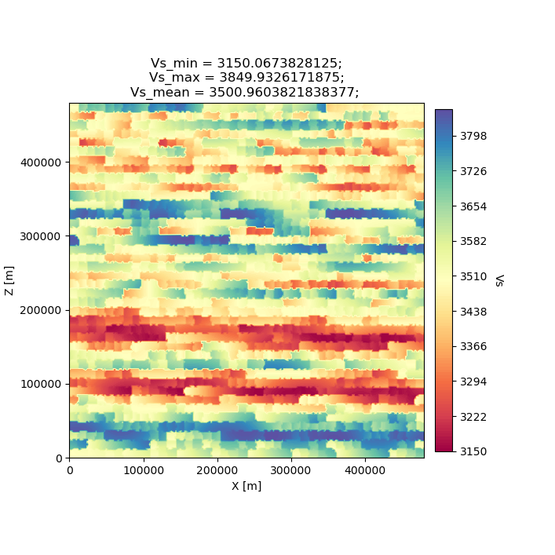
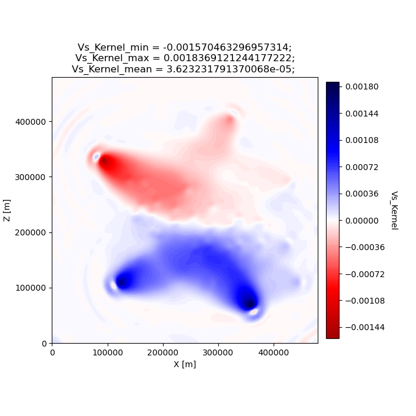
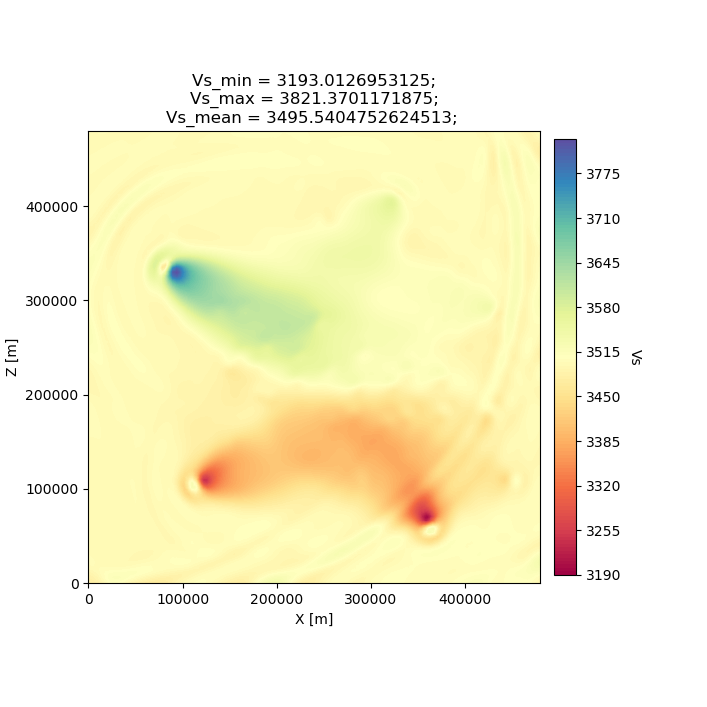

Specfem2D Workstation Example
=============================

SeisFlows comes with some **Specfem2D synthetic examples** to showcase
the package. These examples are meant to be run on a **local machine**
(tested on a Linux workstation running CentOS 7, and an Apple Laptop
running macOS 10.14.6).

The numerical solver we will use is:
`SPECFEM2D <https://geodynamics.org/cig/software/specfem2d/>`__. We’ll
also be working in our ``seisflows``
`Conda <https://docs.conda.io/en/latest/>`__ environment, see the
installation documentation page for instructions on how to install and
activate the required Conda environment.

--------------

.. warning:: 
    If you do not have a compiled version of SPECFEM2D, then each example will attempt to automatically download and compile SPECFEM2D. This step may fail if you do not have software required by SPECFEM2D, if there are issues with the SPECFEM2D repository itself, or if the configuration and compiling steps fail. If you run any issues, it is recommended that you manually install and compile SPECFEM2D, and directly provide its path to this example problem using the -r or --specfem2d_repo flags (shown below).

.. code:: ipython3

    from IPython.display import Image  # To display .png files in the notebook

Example #1: Simple, default inversion
-------------------------------------

Example #1 runs a 1-iteration synthetic inversion with 1 event and 1
station, used to illustrate misfit kernels in adjoint tomography.

The starting model (MODEL_INIT) and target model (MODEL_TRUE) are used
to generate synthetics and data, respectively. Both models are
homogeneous halfspace models with slightly varying P- and S-wave
velocity values. Only Vp and Vs are updated during the example.

Misfit during Example #1 is defined by a ‘traveltime’ misfit using the
default preprocessing module. It also uses a gradient-descent
optimization algorithm paired with a bracketing line search. No
smoothing/regularization is applied to the gradient.

.. code:: ipython3

    ! seisflows examples 1  # print example help dialogue

.. parsed-literal::

    No existing SPECFEM2D repo given, default to: /home/bchow/REPOSITORIES/seisflows/docs/notebooks/specfem2d
    
                                        @@@@@@@@@@                        
                                   .@@@@.    .%&(  %@.          
                                @@@@   @@@@   &@@@@@@ ,%@       
                             @@@@   @@@,  /@@              @    
                            @@@   @@@@   @@@              @     
                          @@@@   @@@@   @@@                @  @ 
                          @@@   @@@@   ,@@@                @ @  
                         @@@@   @@@@    @@@@              @@ @ @
                         @@@@   @@@@@    @@@@@          @@@ @@ @
                         @@@@    @@@@@     @@@@@@@@@@@@@@  @@  @
                          @@@@    @@@@@@        @@@&     @@@  @ 
                          @@@@@     @@@@@@@@         %@@@@#  @@ 
                            @@@@#      @@@@@@@@@@@@@@@@@   @@   
                             &@@@@@          @@@@(       @@&    
                                @@@@@@@             /@@@@       
                                    @@@@@@@@@@@@@@@@@
                                        @@@@@@@@@@          
    
    
    ================================================================================
                                  SEISFLOWS EXAMPLE 1                               
                                  ///////////////////                               
    This is a [SPECFEM2D] [WORKSTATION] example, which will run an inversion to
    assess misfit between two homogeneous halfspace models with slightly different
    velocities. [1 events, 1 station, 1 iterations]. The tasks involved include:
    
    1. (optional) Download, configure, compile SPECFEM2D
    2. Set up a SPECFEM2D working directory
    3. Generate starting model from 'Tape2007' example
    4. Generate target model w/ perturbed starting model
    5. Set up a SeisFlows working directory
    6. Run the inversion workflow
    ================================================================================

Running the example
~~~~~~~~~~~~~~~~~~~

You can either setup and run the example in separate tasks using the
``seisflows examples setup`` and ``seisflows submit`` commands, or by
directly running the example after setup using the ``examples run``
command (illustrated below).

Use the ``-r`` or ``--specfem2d_repo`` flag to point SeisFlows at an
existing SPECFEM2D/ repository (with compiled binaries) if available. If
not given, SeisFlows will automatically download, configure and compile
SPECFEM2D in your current working directory.

.. code:: ipython3

    ! seisflows examples setup 1 -r ${PATH_TO_SPECFEM2D}
    ! seisflows submit
    
    # The above commands are the same as the below
    ! seisflows examples run 1 --specfem2d_repo ${PATH_TO_SPECFEM2D}

A successfully completed example problem will end with the following log
messages:

.. code:: bash

    LINE SEARCH STEP COUNT 02
    --------------------------------------------------------------------------------
    2022-08-29 15:50:58 (I) | evaluating objective function for source 001
    2022-08-29 15:50:58 (D) | running forward simulation with 'Specfem2D'
    2022-08-29 15:51:03 (D) | quantifying misfit with 'Default'
    2022-08-29 15:51:03 (D) | misfit for trial model (f_try) == 4.61E-01
    2022-08-29 15:51:03 (D) | step length(s) = 0.00E+00, 4.78E+09, 7.73E+09
    2022-08-29 15:51:03 (D) | misfit val(s)  = 1.04E+00, 2.30E-01, 4.61E-01
    2022-08-29 15:51:03 (I) | pass: bracket acceptable and step length reasonable. returning minimum line search misfit.
    2022-08-29 15:51:03 (I) | line search model 'm_try' parameters: 
    2022-08-29 15:51:03 (I) | 5800.00 <= vp <= 5800.00
    2022-08-29 15:51:03 (I) | 3431.53 <= vs <= 3790.00
    2022-08-29 15:51:03 (I) | trial step successful. finalizing line search
    2022-08-29 15:51:03 (I) | 
    FINALIZING LINE SEARCH
    --------------------------------------------------------------------------------
    2022-08-29 15:51:03 (I) | writing optimization stats
    2022-08-29 15:51:03 (I) | renaming current (new) optimization vectors as previous model (old)
    2022-08-29 15:51:03 (I) | setting accepted trial model (try) as current model (new)
    2022-08-29 15:51:03 (I) | misfit of accepted trial model is f=2.304E-01
    2022-08-29 15:51:03 (I) | resetting line search step count to 0
    2022-08-29 15:51:03 (I) | 
    CLEANING WORKDIR FOR NEXT ITERATION
    --------------------------------------------------------------------------------
    2022-08-29 15:51:05 (I) | thrifty inversion encountering first iteration, defaulting to standard inversion workflow
    2022-08-29 15:51:06 (I) | 
    ////////////////////////////////////////////////////////////////////////////////
                                 COMPLETE ITERATION 01                              
    ////////////////////////////////////////////////////////////////////////////////
    2022-08-29 15:51:06 (I) | setting current iteration to: 2

    
Using the `working directory documentation page <working_directory.html>`__ you can figure out how to navigate around and look at the results of this small inversion problem. 

We will have a look at a few of the files and directories here. I've run the example problem in a scratch directory but your output directory should look the same.

.. code:: ipython3

    %cd ~/Work/scratch/example_1
    ! ls

.. parsed-literal::

    /home/bchow/Work/scratch/example_1
    logs	parameters.yaml  sflog.txt    specfem2d
    output	scratch		 sfstate.txt  specfem2d_workdir

In the ``output/`` directory, we can see our starting model
(MODEL_INIT), our target model (MODEL_TRUE) and the updated model from
our first iteration (MODEL_01) alongside the gradient that was used to
create it (GRADIENT_01).

.. code:: ipython3

    ! ls output
    ! echo
    ! ls output/MODEL_01

.. parsed-literal::

    GRADIENT_01  MODEL_01  MODEL_INIT  MODEL_TRUE
    
    proc000000_vp.bin  proc000000_vs.bin

Because we’re working with SPECFEM2D, we can plot the models and
gradients that were created during our workflow using the
``seisflows plot2d`` command. If we use the ``--savefig`` option we can
also save the output .png files to disk. Because this docs page was made
in a Jupyter Notebook, we need to use the IPython Image class to open
the resulting .png file.

This figure shows the starting homogeneous halfspace model in Vs.

.. code:: ipython3

    ! seisflows plot2d MODEL_INIT vs --savefig m_init_vs.png
    Image(filename='m_init_vs.png') 

.. parsed-literal::

    Figure(707.107x707.107)

.. image:: images/specfem2d_example_files/specfem2d_example_13_1.png

Here we see the gradient created during the adjoint simulation.

.. code:: ipython3

    ! seisflows plot2d GRADIENT_01 vs_kernel --savefig g_01_vs.png
    Image(filename='g_01_vs.png') 

.. parsed-literal::

    Figure(707.107x707.107)

.. image:: images/specfem2d_example_files/specfem2d_example_15_1.png

Finally we see the updated model, which is the sum of the initial model,
and a scaled gradient.

.. code:: ipython3

    ! seisflows plot2d MODEL_01 vs --savefig m_01_vs.png
    Image(filename='m_01_vs.png') 

.. parsed-literal::

    Figure(707.107x707.107)

.. image:: images/specfem2d_example_files/specfem2d_example_17_1.png

Have a look at the `working directory documentation page <working_directory.html>`__ for more detailed explanations of how to navigate the SeisFlows working directory. You can also run Example \#1 with more stations (up to 131), tasks/events (up to 25) and iterations (as many as you want). Note that because this is a serial inversion, the compute time will scale with all of these values.

.. code:: ipython3

    ! seisflows examples run 1 --nsta 10 --ntask 5 --niter 2

Example #2: Pyaflowa, L-BFGS inversion
--------------------------------------

Example #2 runs a 2 iteration inversion with misfit quantification taken
care of by the ``Pyaflowa`` preprocessing module. Optimization (i.e.,
model updates) are performed using the ``L-BFGS`` algorithm. This
example is more complex than the default version of Example #1, using
multiple events, stations and iterations. Example #2 also includes
smoothing/regularization of the gradient before using it to perturb the
starting velocity model.

.. code:: ipython3

    ! seisflows examples 2

.. parsed-literal::

    No existing SPECFEM2D repo given, default to: /home/bchow/Work/scratch/example_1/specfem2d
    
                                        @@@@@@@@@@                        
                                   .@@@@.    .%&(  %@.          
                                @@@@   @@@@   &@@@@@@ ,%@       
                             @@@@   @@@,  /@@              @    
                            @@@   @@@@   @@@              @     
                          @@@@   @@@@   @@@                @  @ 
                          @@@   @@@@   ,@@@                @ @  
                         @@@@   @@@@    @@@@              @@ @ @
                         @@@@   @@@@@    @@@@@          @@@ @@ @
                         @@@@    @@@@@     @@@@@@@@@@@@@@  @@  @
                          @@@@    @@@@@@        @@@&     @@@  @ 
                          @@@@@     @@@@@@@@         %@@@@#  @@ 
                            @@@@#      @@@@@@@@@@@@@@@@@   @@   
                             &@@@@@          @@@@(       @@&    
                                @@@@@@@             /@@@@       
                                    @@@@@@@@@@@@@@@@@
                                        @@@@@@@@@@          
    
    
    ================================================================================
                                  SEISFLOWS EXAMPLE 2                               
                                  ///////////////////                               
    This is a [SPECFEM2D] [WORKSTATION] example, which will run an inversion to
    assess misfit between a starting homogeneous halfspace model and a target
    checkerboard model. This example problem uses the [PYAFLOWA] preprocessing
    module and the [LBFGS] optimization algorithm. [4 events, 32 stations, 2
    iterations]. The tasks involved include:
    
    1. (optional) Download, configure, compile SPECFEM2D
    2. Set up a SPECFEM2D working directory
    3. Generate starting model from 'Tape2007' example
    4. Generate target model w/ perturbed starting model
    5. Set up a SeisFlows working directory
    6. Run the inversion workflow
    ================================================================================

You can run the example with the same command as shown for Example 1:

.. code:: ipython3

    ! seisflows examples run 2 -r ${PATH_TO_SPECFEM2D}

Succesful completion of the example problem will end with the following log message

.. code:: bash

        LINE SEARCH STEP COUNT 01
    --------------------------------------------------------------------------------
    2022-08-29 18:07:14 (I) | evaluating objective function for source 001
    2022-08-29 18:07:14 (D) | running forward simulation with 'Specfem2D'
    2022-08-29 18:07:20 (D) | quantifying misfit with 'Pyaflowa'
    2022-08-29 18:07:29 (I) | evaluating objective function for source 002
    2022-08-29 18:07:29 (D) | running forward simulation with 'Specfem2D'
    2022-08-29 18:07:35 (D) | quantifying misfit with 'Pyaflowa'
    2022-08-29 18:07:43 (I) | evaluating objective function for source 003
    2022-08-29 18:07:43 (D) | running forward simulation with 'Specfem2D'
    2022-08-29 18:07:49 (D) | quantifying misfit with 'Pyaflowa'
    2022-08-29 18:07:58 (I) | evaluating objective function for source 004
    2022-08-29 18:07:58 (D) | running forward simulation with 'Specfem2D'
    2022-08-29 18:08:04 (D) | quantifying misfit with 'Pyaflowa'
    2022-08-29 18:08:13 (D) | misfit for trial model (f_try) == 4.73E-03
    2022-08-29 18:08:13 (D) | step length(s) = 0.00E+00, 1.00E+00
    2022-08-29 18:08:13 (D) | misfit val(s)  = 5.30E-02, 4.73E-03
    2022-08-29 18:08:13 (I) | pass: misfit decreased, line search successful w/ alpha=1.0
    2022-08-29 18:08:13 (I) | line search model 'm_try' parameters: 
    2022-08-29 18:08:13 (I) | 5800.00 <= vp <= 5800.00
    2022-08-29 18:08:13 (I) | 3193.01 <= vs <= 3821.37
    2022-08-29 18:08:13 (I) | trial step successful. finalizing line search
    2022-08-29 18:08:13 (I) | 
    FINALIZING LINE SEARCH
    --------------------------------------------------------------------------------
    2022-08-29 18:08:13 (I) | writing optimization stats
    2022-08-29 18:08:13 (I) | renaming current (new) optimization vectors as previous model (old)
    2022-08-29 18:08:13 (I) | setting accepted trial model (try) as current model (new)
    2022-08-29 18:08:13 (I) | misfit of accepted trial model is f=4.727E-03
    2022-08-29 18:08:13 (I) | resetting line search step count to 0
    2022-08-29 18:08:13 (I) | 
    CLEANING WORKDIR FOR NEXT ITERATION
    --------------------------------------------------------------------------------
    2022-08-29 18:08:15 (I) | thrifty inversion encountering final iteration, defaulting to inversion workflow
    2022-08-29 18:08:21 (I) | 
    ////////////////////////////////////////////////////////////////////////////////
                                 COMPLETE ITERATION 02                              
    ////////////////////////////////////////////////////////////////////////////////
    2022-08-29 18:08:21 (I) | setting current iteration to: 3

As with Example \#1, we can look at the output gradients and models to visualize how the inversion performed.

.. code:: ipython3

    %cd ~/Work/scratch/example_2
    ! ls

.. parsed-literal::

    /home/bchow/Work/scratch/example_2
    logs	parameters.yaml  sflog.txt    specfem2d
    output	scratch		 sfstate.txt  specfem2d_workdir

.. code:: ipython3

    ! seisflows plot2d  # to check what models/gradients/kernels are avilable for plotting

.. parsed-literal::

                                         PLOT2D                                     
                                         //////                                     
    Available models/gradients/kernels
    
    GRADIENT_01
    GRADIENT_02
    MODEL_01
    MODEL_02
    MODEL_INIT
    MODEL_TRUE

The starting model is a homogeneous halfspace but for Example #2 the
target model is a checkerboard.

.. code:: ipython3

    ! seisflows plot2d MODEL_TRUE vs --savefig m_true_vs.png
    Image(filename='m_true_vs.png') 

.. parsed-literal::

    Figure(707.107x707.107)

In the following gradient Vs kernel, we can see how the 5km x 5km
smoothing blurs away some of the detail of the raw graident. The blue
colors here suggest that the initial model needs to be sped up to best
fit waveforms (and vice versa, red colors suggest slowing down the
initial model).

.. code:: ipython3

    ! seisflows plot2d GRADIENT_01 vs_kernel --savefig g_01_vs.png
    Image(filename='g_01_vs.png') 

.. parsed-literal::

    Figure(707.107x707.107)

.. code:: ipython3

    ! seisflows plot2d MODEL_02 vs --savefig m_02_vs.png
    Image(filename='m_02_vs.png') 

.. parsed-literal::

    Figure(707.107x707.107)

